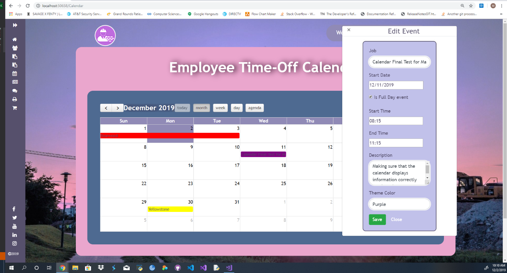
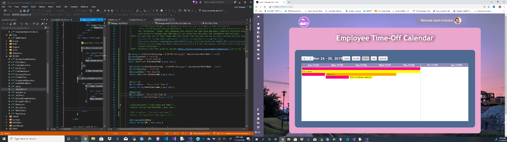

# Back-End-Project-Portfolio

Portfolio for professional development, centered around my back end projects
 

### Introduction
 
During my final sprint with The Tech Academy I was working on the back end of the C# project.  This sprint was different then my other C# sprints in the sense that I spent most of my time working on 2 large stories on the same part of the project.  In some ways I found it funny that I was once again working on a projects calendar, the difference was that in the python project I implemented and built the calendar from scratch, in this project I was working with a functioning calendar that just had a lot of issues.  Overall this was my favorite of the sprints and I felt like I really accomplished a lot and made some large contributions to the project. 

The first story I did during this sprint was to further integrate the consequences of user suspension into the project.  What I needed to go was make is so when a user was suspended, they were removed from all the schedule items assigned to them and if they were a manager on a job make the job manager position reset to null.  Also, I was tasked with making the change that if a user was demoted from manager to employee, jobs they managed on would reset to null as well.  With all these changes I needed to create alert messages that would inform the admin of the pending changes if they continued with the suspension or demotion.

After that first story was done, I took on the calendar story.  When I started on it, I was initially just supposed to add functionality to be able to automatically generate job action items to the calendar, but it would turn into a larger project.  As I worked on implementing my story, I kept running into issues with how the calendar worked so I reached out to my project manager to advise her of the issues and ask if she would like me to fix them.  She gave me an additional story related to the calendar and allowed me to make the necessary changes to get the calendar functioning as intended.  For this project I did a lot of work on the models associated with the calendar, jobs and schedules to make everything come together more cohesively.  I also worked hard to make sure the controllers were updated so everything would work.  The most challenging part of this story for me was figuring out how the java script was done for the event edit modals for the calendar, I struggled to make heads and tails of what had been done, largely because none of it was commented.  Eventually I figured it out and was able to make the necessary changes so that everything would display correctly and that full CRUD functionality for the calendar was working.
 

 
Below is the code I used to get the job action items and convert them into calendar event items, then to check if any event matching that description was already on the calendar and if it was not to then save it to the DB so it could be rendered on the calendar. You can see that I had left a chunk of code in related to determining if an event was all day but I changed the way the models worked so that the all day attribute would be brought in with the schedule or action item. 
 

  //get for job action items 
        [HttpGet] 
        public void ShowJobActionItems() 
        { 
            var actionItems = db.JobActions.ToList(); 
            foreach(var actionItem in actionItems) 
            { 
                var actionEvent = new CalendarEvent(); 
                //convert action items into calendar events 
                actionEvent.Subject = actionItem.Name; 
                actionEvent.Start = Convert.ToDateTime(actionItem.StartDateTime); 
                actionEvent.End = Convert.ToDateTime(actionItem.EndDateTime); 
                actionEvent.EventStart = actionItem.EventStartTime; 
                actionEvent.EventEnd = actionItem.EventEndTime; 
                actionEvent.Description = actionItem.Description; 
                actionEvent.ThemeColor = actionItem.Job.ThemeColor; 
                actionEvent.JobName = actionItem.Job.JobTitle.ToString(); 
                actionEvent.JobId = actionItem.Job.JobIb.ToString(); 
                actionEvent.IsFullDay = actionItem.FullDay; 
                //added in Is Active incase we decide in the future to only have calendar events show up if the associated job is active. 
                actionEvent.IsActive = actionItem.Job.Active; 
                //No Longer need the below code since the IsFullDay attribute is dictated by the job action item. 
                //if (actionItem.EndDateTime != null) 
                //{ 
                //    TimeSpan interval = Convert.ToDateTime(actionItem.EndDateTime) - Convert.ToDateTime(actionItem.StartDateTime); 
                //    if (interval.Days > 1) 
                //    { 
                //        actionEvent.IsFullDay = false; 
                //    } 
                //    else 
                //    { 
                //        actionEvent.IsFullDay = true; 
                //    } 
                //} 
                //else 
                //{ 
                //    actionEvent.IsFullDay = false; 
                //} 
                actionEvent.ScheduleId = Convert.ToString(actionItem.JobActionId); 
                if (actionEvent.End > DateTime.Now.Date && actionEvent.Start < DateTime.Now.Date) 
                { 
                    actionEvent.Start = DateTime.Now.AddMinutes(1); 
                } 
                try 
                { 
                    if (ModelState.IsValid) 
                    { 
                        //check if an event with a matching ScheduleId is currently on the calendar 
                        var match = db.CalendarEvents.Where(a => a.ScheduleId == actionEvent.ScheduleId).SingleOrDefault(); 
                        if (match != null) 
                        { 
                            var newActionEvent = match; 
                            //check for differences in any properties between events with matching ScheduleId and update db 
                            if (newActionEvent.Subject != actionEvent.Subject) 
                            { 
                                actionEvent.Subject = newActionEvent.Subject; 
                            } 
                            if (newActionEvent.Start != actionEvent.Start) 
                            { 
                                actionEvent.Start = newActionEvent.Start; 
                            } 
                            if (newActionEvent.End != actionEvent.End) 
                            { 
                                actionEvent.End = newActionEvent.End; 
                            } 
                            if (newActionEvent.EventStart != actionEvent.EventStart) 
                            { 
                                actionEvent.EventStart = newActionEvent.EventStart; 
                            } 
                            if (newActionEvent.EventEnd != actionEvent.EventEnd) 
                            { 
                                actionEvent.EventEnd = newActionEvent.EventEnd; 
                            } 
                            if (newActionEvent.Description != actionEvent.Description) 
                            { 
                                actionEvent.Description = newActionEvent.Description; 
                            } 
                            if (newActionEvent.IsFullDay != actionEvent.IsFullDay) 
                            { 
                                actionEvent.IsFullDay = newActionEvent.IsFullDay; 
                            } 
                            //Added ThemeColor to capture Job Color 
                            if (newActionEvent.ThemeColor != actionEvent.ThemeColor) 
                            { 
                                actionEvent.ThemeColor = newActionEvent.ThemeColor;  
                            } 
                            if(newActionEvent.JobName != actionEvent.JobName) 
                            { 
                                actionEvent.JobName = newActionEvent.JobName;
                            } 
                            if(newActionEvent.JobId != actionEvent.JobId) 
                            { 
                                actionEvent.JobId = newActionEvent.JobId; 
                            } 
                            if (newActionEvent.IsActive != actionEvent.IsActive) 
                            { 
                                actionEvent.IsActive = newActionEvent.IsActive; 
                            } 
                            //update database entry 
                            db.Entry(newActionEvent).State = EntityState.Modified; 
                            db.SaveChanges(); 
                        } 
                        else //add new event 
                        { 
                            db.CalendarEvents.Add(actionEvent); 
                            db.SaveChanges(); 
                        } 
                    } 
                } 
                catch 
                { 
                    throw new ArgumentException("Event cannot end before today's date."); 
                } 

 
During this story I learned a lot, but mostly I realized that I had become a competent junior level developer.  I was able to solve these issues on my own and even go on to take more stock in the project to help solve other issues.  I am extremely proud of the work I did during this sprint, more so than the others because I finally felt like I was working on the project as a developer as opposed to a student.  This calendar posed a lot of challenges to me and I felt like I did a good job meeting those challenges head on and creating code that I could be proud of and more importantly works.  I know there is still so much more out there to learn, and I cannot wait to get to work on that, but I now feel confident that I have a solid base to build my career upon.

#### Other Skills learned
 
•	I gained a much deeper understanding of Java Script during this project. 
•	Learned how to better build models that will be used for relational databases. 
•	I feel better about taking on larger projects after this sprint. 
•	The importance of bouncing ideas off your project manager to see if they want to implement your ideas as opposed to how the story was originally written.  Essentially if you have what may be a better idea always ask, there’s no harm in proposing something that could make for a better end product. 
